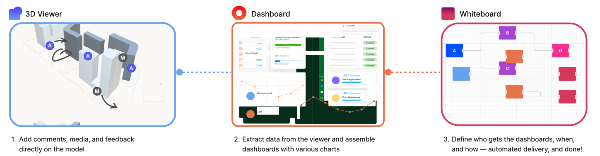

# MDLR

**MDLR** is an open-source platform designed to streamline your project management workflow by integrating three essential tools into a single platform:

- **3D Viewer**: Visualize your project in real-time with an interactive 3D viewer.
- **Whiteboard**: Gain valuable project insights and collaborate with your team in a dynamic space.
- **Dashboards**: Make data-driven decisions using our customizable dashboard tools.

Whether you're managing complex projects or analyzing data, MDLR provides the flexibility and tools you need to succeed.

## Roadmap

Our first major entity is planned for release on **1st November 2024**. Stay tuned for updates and new features!
